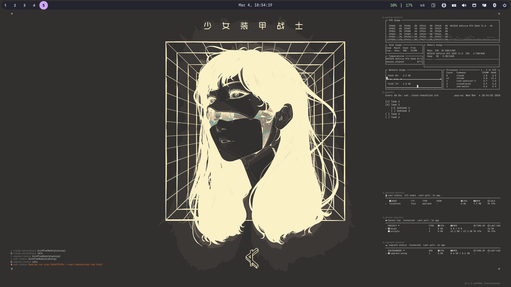
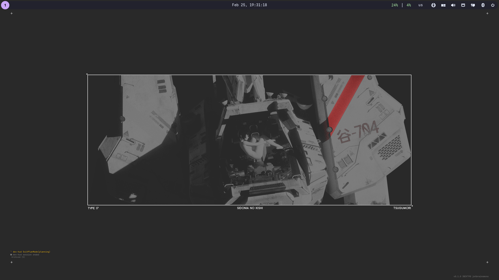
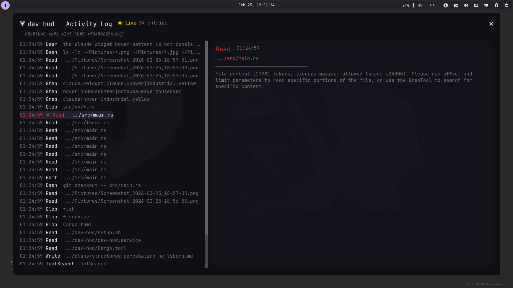

# dev-hud

A transparent Wayland overlay HUD for monitoring Claude Code sessions in real time.
Built with [iced](https://iced.rs) + [iced_layershell](https://github.com/waycrate/exwlshelleventloop)
for wlroots-compatible compositors (sway, COSMIC, etc.).



| Overlay | Activity log modal |
|---------|--------------------|
|  |  |

## Features

- **Multi-session monitoring** — watches `~/.claude/projects/` for all active Claude
  Code sessions across projects, displays each with its resolved project name and
  per-category animated spinners for tool activity (Read, Write, Bash, Grep, etc.)
- **Subagent tracking** — subagents spawned by a session render as a tree beneath their
  parent, each with its own activity indicator and attention flag
- **Shell widgets** — embed arbitrary command output on the overlay via a hot-reloaded
  config file (`~/.config/viz/shells.md`). Supports oneshot, streaming, and full TUI
  mode (PTY with `vt100` rendering). Configurable position, font size, and visibility
- **Activity log modal** — click a session (in focused mode) to open a scrollable
  activity log with detail pane, error highlighting, and guardrail block indicators
- **Needs-attention indicators** — sessions with stale tool calls or awaiting user input
  show a bell icon to draw your eye
- **Theme system** — dark, light, auto (follows DE), and adaptive (samples screen
  luminance) modes with 5-second dynamic refresh
- **Backdrop** — toggleable semi-transparent pill behind session rows for readability
  over any background
- **Session archiving** — exited sessions stay visible for a 5-minute grace period,
  then auto-archive; archived sessions are browsable in a dedicated modal
- **Multi-monitor** — target a specific output via `DEV_HUD_SCREEN` or cycle through
  monitors with `dev-hud-ctl screen`
- **IPC control** — Unix socket at `$XDG_RUNTIME_DIR/dev-hud.sock` driven by the
  `dev-hud-ctl` CLI

## Install

### Homebrew (Linux)

```sh
brew tap fuabioo/tap
brew install dev-hud
```

After installing, follow the printed caveats to set up the systemd service.

### From source

Requires Rust 2024 edition (1.85+) and Wayland development libraries.

```sh
./setup.sh install     # build release, symlink binaries, enable & start service
./setup.sh uninstall   # stop, disable, remove everything
./setup.sh status      # show service state and binary locations
```

This builds the release binary, symlinks `dev-hud` and `dev-hud-ctl` into
`~/.local/bin/`, and enables a systemd user service that starts automatically
with your graphical session.

To set the default monitor, edit `DEV_HUD_SCREEN` in `dev-hud.service`:

```ini
Environment=DEV_HUD_SCREEN=DP-2
```

Then `./setup.sh install` to apply.

## Usage

```sh
# Start the HUD (runs as a background Wayland overlay)
dev-hud

# Control via IPC
dev-hud-ctl toggle              # toggle HUD visibility
dev-hud-ctl focus               # toggle focus/interactivity (enables click)
dev-hud-ctl claude-live         # toggle live Claude Code session watcher
dev-hud-ctl shell-toggle        # toggle shell output widgets
dev-hud-ctl theme-toggle        # cycle between dark and light
dev-hud-ctl theme dark          # force dark theme
dev-hud-ctl theme light         # force light theme
dev-hud-ctl theme auto          # follow DE system theme (updates every 5s)
dev-hud-ctl theme adaptive      # sample screen under HUD to pick theme
dev-hud-ctl bg-toggle           # toggle semi-transparent backdrop
dev-hud-ctl screen              # cycle HUD to next monitor
dev-hud-ctl screen DP-1         # move HUD to specific output
dev-hud-ctl modal-close         # close activity log modal
dev-hud-ctl archive-show        # open archived sessions modal
dev-hud-ctl archive-close       # close archived sessions modal

# Demo mode (simulated sessions for testing)
dev-hud-ctl demo claude-toggle
dev-hud-ctl demo loader-toggle
dev-hud-ctl demo loader-change
dev-hud-ctl demo font-change
```

## Shell widgets

Shell widgets embed command output directly on the overlay. Configure them in
`~/.config/viz/shells.md` (hot-reloaded, no restart needed):

```markdown
# system-monitor
- command: gotop --nvidia
- mode: tui
- visible: always
- position: top-right
- rows: 17
- cols: 120
- font_size: 6.5

# docker-monitor
- command: docker-status --hide-help
- mode: tui
- visible: always
- position: bottom-right
- rows: 12
- cols: 80
```

HTML comments (`<!-- ... -->`) can be used to disable entries.

| Option      | Values                                              | Default      |
|-------------|-----------------------------------------------------|--------------|
| `command`   | any shell command                                   | (required)   |
| `mode`      | `oneshot`, `stream`, `tui` (auto-detected if omitted) | auto       |
| `visible`   | `focus`, `always`                                   | `focus`      |
| `position`  | `top-left`, `top-right`, `bottom-left`, `bottom-right` | `bottom-right` |
| `rows`      | PTY rows for tui mode                               | `24`         |
| `cols`      | truncation width / PTY cols                         | `120`        |
| `lines`     | visible output lines for stream/oneshot             | `16`         |
| `font_size` | per-widget override                                 | theme default |

Modes:
- **oneshot/stream** — spawned via `sh -c`, output read line-by-line
- **tui** — spawned in a PTY with `TERM=xterm-256color`, output parsed by `vt100`

## Keybindings (COSMIC DE)

COSMIC reads custom shortcuts from a RON file that is reloaded live (no restart
needed). The file is at:

```
~/.config/cosmic/com.system76.CosmicSettings.Shortcuts/v1/custom
```

Example configuration with dev-hud bindings:

```ron
{
    (modifiers: [Super]): System(Launcher),
    (modifiers: [Super], key: "F7"):  Spawn("dev-hud-ctl bg-toggle"),
    (modifiers: [Super], key: "F8"):  Spawn("dev-hud-ctl theme-toggle"),
    (modifiers: [Super], key: "F9"):  Spawn("dev-hud-ctl toggle"),
    (modifiers: [Super], key: "F10"): Spawn("dev-hud-ctl focus"),
}
```

| Shortcut      | Action                              |
|---------------|-------------------------------------|
| `Super+F7`    | Toggle backdrop behind session rows |
| `Super+F8`    | Cycle dark / light theme            |
| `Super+F9`    | Toggle HUD visibility               |
| `Super+F10`   | Toggle focus (enable click)         |

`dev-hud-ctl` must be in `$PATH` for the shortcuts to work.

### Sway / other wlroots compositors

Add to your sway config (`~/.config/sway/config`):

```
bindsym $mod+F7  exec dev-hud-ctl bg-toggle
bindsym $mod+F8  exec dev-hud-ctl theme-toggle
bindsym $mod+F9  exec dev-hud-ctl toggle
bindsym $mod+F10 exec dev-hud-ctl focus
```

## Theme modes

| Mode       | Behavior |
|------------|----------|
| `dark`     | White text, dark overlays (static) |
| `light`    | Dark text, light overlays (static) |
| `auto`     | Detects DE preference every 5s (COSMIC config, XDG portal, gsettings, GTK_THEME) |
| `adaptive` | Captures a screenshot every 5s, computes luminance of the bottom-left quadrant, switches theme to match. Auto-enables backdrop. Uses `grim` or `cosmic-screenshot`. |

`theme-toggle` flips the current appearance without changing the active mode. In
auto/adaptive modes the 5-second refresh will re-evaluate and may switch back if the
environment disagrees.

## Runtime dependencies

- **Wayland compositor** with layer-shell support
- **`cosmic-randr`** or **`wlr-randr`** — for screen cycling (optional; set output
  manually via `DEV_HUD_SCREEN` if unavailable)
- **`grim`** or **`cosmic-screenshot`** — for adaptive mode screen sampling (optional;
  falls back gracefully)
- **`wl-copy`** — for the copy-session-UUID button in the modal (optional)

## Architecture

```
src/
  main.rs              Entry point
  app.rs               HUD state machine, iced update/view, IPC dispatch
  session.rs           Session/subagent models, archive logic, activity log
  theme.rs             ThemeMode, ThemeColors, system detection, screen sampling
  events.rs            Claude Code JSONL event types and tool categories
  util.rs              String helpers (truncation, slug resolution)
  loader.rs            Spinner/loader animation styles
  surface.rs           Layer shell surface settings
  views/
    mod.rs             View router
    hud.rs             Main overlay rendering (sessions, shells, markers)
    modal.rs           Activity log modal
    archive.rs         Archived sessions modal
  ipc.rs               Unix socket listener, subscriptions, tick streams
  shell/
    mod.rs             Shell process management, PTY spawning, ShellState
    config.rs          Shell widget config parsing (~/.config/viz/shells.md)
  watcher/
    mod.rs             Multi-session file watcher
    scanner.rs         JSONL directory scanner
    parser.rs          Event stream parser
  bin/
    dev-hud-ctl.rs     CLI client for the IPC socket
```
